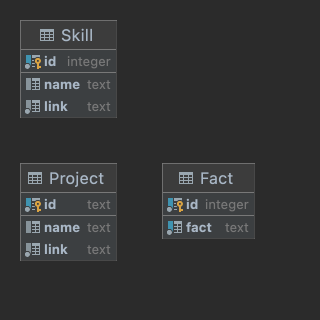

# Федотенко Николай Владимирович M33122
___

## Схема данных в виде ERD диаграммы:

## Значение сущностей
- **Fact** (блок "_Главные факты обо мне_"):
  - **id** — уникальный идентификатор (_числовой автоинкремент_);
  - **fact** — строка с фактом, должна быть _уникальной_.
- **Skill** (блок "_Мой стэк_"):
  - **id** — уникальный идентификатор (_числовой автоинкремент_);
  - **name** — название навыка, может быть _пустым_;
  - **link** — ссылка на картинку с навыком.
- **Project** (блок "_Мои проекты_"):
  - **id** — уникальный идентификатор (_строка для удобства_);
  - **name** — название проекта, может быть _пустым_;
  - **link** — ссылка на картинку с проектом.
